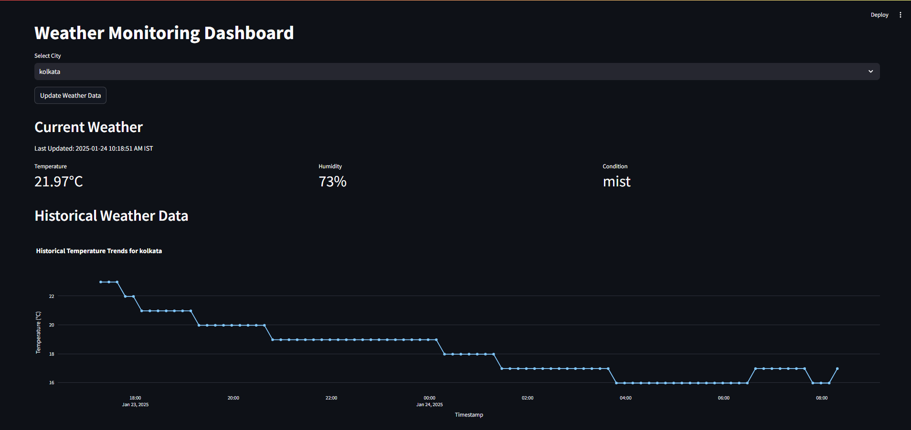
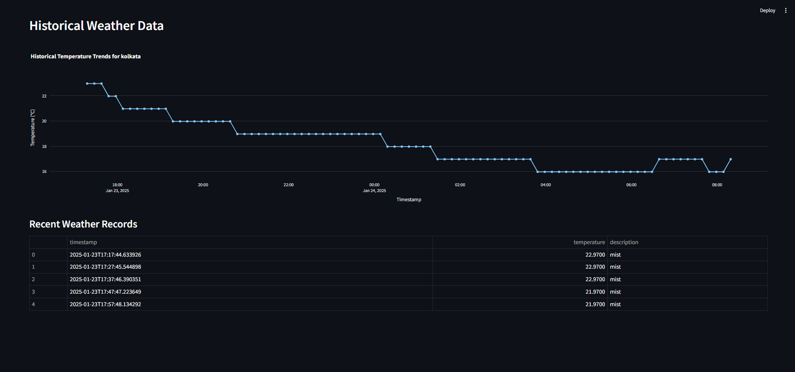
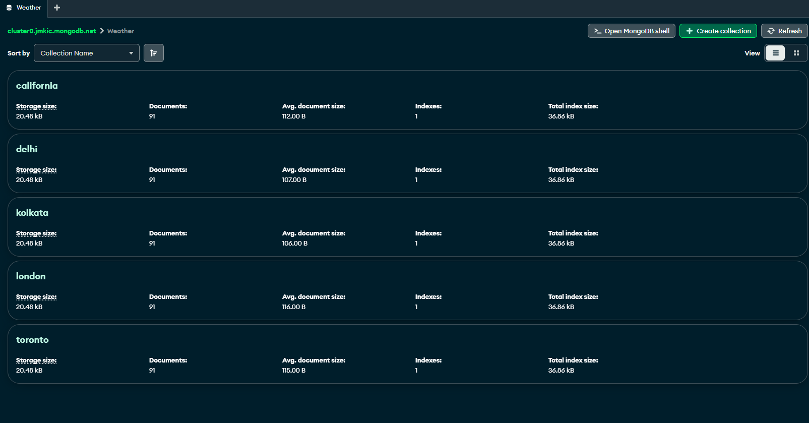

# Weather Monitoring Dashboard

A real-time weather monitoring system that collects and visualizes weather data from multiple cities using OpenWeather API.

## Features

- Real-time weather data collection
- Historical weather data visualization
- MongoDB integration for data storage
- Interactive dashboard using Streamlit
- Support for multiple cities

## Setup

1. Install dependencies:
```bash
pip install -r requirements.txt
```

2. Create a `.env` file with the following variables:
```env
OPENWEATHER_API_KEY=your_api_key
MONGO_URI=your_mongo_connection_string
MONGO_DB_NAME=Weather
MYSQL_HOST=localhost
MYSQL_USER=your_username
MYSQL_PASSWORD=your_password
MYSQL_DATABASE=mydb
```

3. Run the data collection script:
```bash
python newtest.py
```

4. Launch the dashboard:
```bash
streamlit run streamlit_app.py
```

## Screenshots

### Current Weather Display

*Real-time weather information with temperature, humidity, and conditions*

### Historical Data Visualization

*Temperature trends visualization with interactive plotly graph*

### Recent Weather Records

*Tabular view of recent weather records from MongoDB*

## Components

- `streamlit_app.py`: Main dashboard application
- `newtest.py`: Data collection script
- `sql.py`: MySQL database utilities

## Technologies

- Python 3.8+
- Streamlit
- MongoDB
- MySQL
- OpenWeather API
- Plotly
